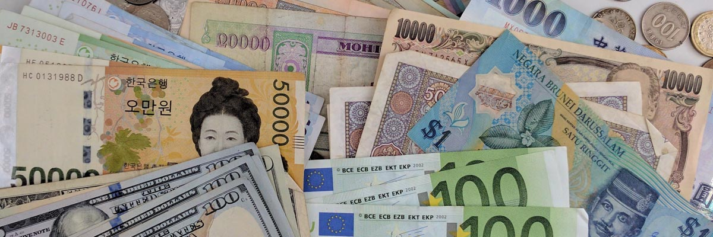
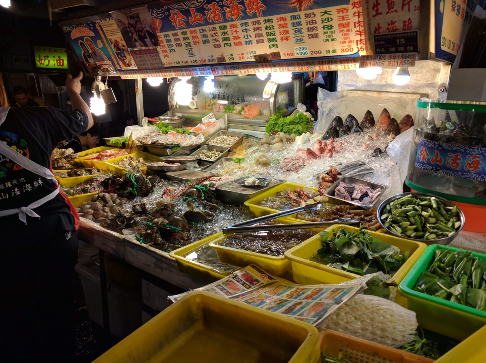

Yes, you read the title correctly, I save money by traveling the world. In fact, I cut spending almost **in half** the past 6 months. Now I know that this might not apply to everyone but I want to share how it applied to myself and how you can as well. Obviously where you are traveling to and what kind of accommodations you are staying at will impact how much you spend but with the right planning, it is easier than you think to travel and save. The past 6 months I have traveled to countries with a rather large range of prices so I will list average prices I spent at each location and compare it to the price of staying at home.

**A few things to keep in mind:**

*   _I started my trip on June 21st so to keep all of my estimates at an even 6 months, I will list what I have spent between June 21st, 2016 and January 21st, 2017._
*   _I currently work from "home" but I am making comparisons assuming that instead of working as I travel I was going to a 9-5 office job in the US._
*   _I travel solo so all below expense estimates are for one person. Although it is also cheap to travel as a group, that is an article for a different time._

## Accommodations

So let's pretend that I was not out traveling the world and instead I was renting an apartment back in the US. After a quick Google search, I noticed that one room apartments around where I used to live are around _$600_ _USD_ per month. Now, if you want to spend less than this while overseas, it is pretty obvious that staying at hotels for $100 dollars a night is not a viable option. So the first places to look are hostels, [Airbnb](http://www.airbnb.com.au/c/erics20340), or even couch surfing.

I find hostels to be alright for stays no longer than a week. It depends on the country but a bed in a shared room can usually be found for _$10 - $20 USD per night_ and often include breakfast. Sharing a room with a bunch of strangers can get very stressful so I would not recommend it for over a week. Also, if you are traveling with someone else it would be very difficult to get any privacy. Moreover, if you stay at a hostel for a whole month, it ends up being close to the price of Airbnb so it is not usually worth it. The only time that staying at a hostel long term can be beneficial is if you can make a deal with the owner, part-time work in exchange for a room (and board if you are lucky).

Another option is using [Airbnb](http://www.airbnb.com.au/c/erics20340). With Airbnb, you can book a private room, shared room, or whole house to yourself. Many hosts also give rather large discounts for people that book long term as well. The other day while searching Airbnb, I found someone that gave a **50% discount** for month-long bookings. If you are traveling with other people this can also help you save money.

Finding programs with host families, couch surfing or even just having really good friends in other countries is also great. I will say that I have had some very gracious friends along my journey that have housed me for free or rather cheap and I would like to thank all of them for their generosity. I have learned however that there is such a thing as overstaying your welcome. If you choose to stay with friends, be careful about staying too long without offering rent or utilities. Offering to do some form of work in exchange for a place to sleep can also be a great idea.

##### My accommodation breakdown:

**Kyoto and Tokyo, Japan:**  $0 for 2 months

**Seoul, South Korea:** $420 for 2.5 months

**Taipei, Taiwan:**  $0 for 1 month

**Singapore:**  _$80_ for one week

**Melbourne, Australia:** _$300_ for one month

As you can see, I have managed to do a lot of traveling and only spent **$800** for housing between June 21 and Jan 1\. I also want to make note that all of the places I have stayed at were furnished and very livable, not infested with rats or located in the slums. Compared to **$3,600 for 6 months** ($600/mo), that I would have been spending if I was still back in the US, that is a huge difference just in rent alone.

 Marina Bay Sands hotel in Singapore

## Transportation

One might think that constant flying, taking trains, and buses will add up to be way more than a daily commute to work but I would like to prove that theory wrong. Constant cheap and smart travel can be much cheaper than mindless daily commutes.

The fact that I am location independent means I don't need to buy a car or for anything that goes along with it (maintenance, insurance, gasoline). Although it is possible to get around without a car in larger cities, in cities without solid public transportation like where I am from (Lansing, Michigan, USA) it is just not possible. So let's put together some estimates for 6 months of commuting via car in the US.

So let's say that we are leasing a car for _$300_ a month. Over 6 months that comes out to _$1,800_. Next, We will have to pay for insurance. Let's say that you also pay $300 a month for insurance so, after 6 months, it also comes to _$1,800_. Just to throw a wrench into estimates, let's also assume you will have some small maintenance problem that will cost _$500_ to fix. And last, If you commute 45 minutes to and from work 5 days a week (180 hours) and your gas tank costs $50 dollars to fill up every 5 hours of driving, after 6 months that also comes to _$1,800_. But, I am sure you are also going out on weekends so let's throw another 2 hours of driving every weekend (48hrs). At our above rate for gasoline calculation that comes out to $480\. Now not only does 228 hours in a car sound terrible but that total breakdown for 6 months comes out to **$6,380.**

Now, I will admit I have not owned a car in the US for about 10 years so my estimates are most likely way off. I have not done extensive research, especially for the gasoline estimates. However, it should be close enough to give you an idea of how many costs come with owning a car for 6 months. Compared to the way I have currently been traveling it is definitely way more money.

Airplane tickets are probably the most expensive chunks so I will look back at how much I spent for flights the past 6 months. There is a certain way to play the flight game right so you get lots of free flights and upgrades but since I often fly random budget airlines and I am terrible at keeping track of mileage, I haven't gotten any free flights yet. When I first left to Japan from the US, I bought a 3 month round trip ticket thinking that I would go back home in September. The total for that ticket was _$1265. _I never ended up taking that return flight and I learned from my mistake, from then on I bought only one-way tickets.

#### My airplane breakdown:

**Japan -> South Korea:** $125

**South Korea -> Taiwan:** $200

**Taiwan -> Singapore:** $215

**Singapore -> Australia:** $180

So my total for 6 months of flying is **$1985\.** But we also have to add in local public transportation fees. First, I have to say that public transportation in Japan is insanely expensive. The train ride from Tokyo to Osaka alone cost me $120 dollars. I could have been more conservative with traveling at the time but what is the fun in that? Here is an estimated breakdown of how much I spent on trains/buses/taxis per country:

#### My public transport breakdown:

**Kyoto, Osaka, Kobe, Nara, Shiga, and Tokyo Japan:**  $550 for 2 months

**Seoul, Danyang, Yeongju, and Bonghwa South Korea:** $250 for 2.5 months

**Taipei and Taoyuan, Keelung, Jiufen Taiwan:**  $60 for 1 month

**Singapore:** $20 for 1 week

**Melbourne, Australia:** $40 for month week

So adding all of my costs together with flights, after 6 months I spent a total of **$2,905\.** A little under half of what I would have paid for 6 months in the US.

 Driving in style

## Food

The last major life expense that I will cover is food. This category is difficult to calculate because everyone has different eating habits and the price of ingredients you might be used to varies vastly country to country. This is also a category where I don't really save much money compared to the US. In the US, I eat at home most meals but eat out a few times a week. When I travel, however, my eating habits really depend on the country I am in.

So in the US, when I ate out I would usually go to sandwich places at times when I was craving extra calories (I try to eat clean when cooking at home) and the total was usually around _$10_. I went shopping 2 or 3 times a week and usually spent around _$30_ dollars when I went so let's say my weekly grocery average was _$75_. That means on average I spent _$400_ a month on food. So after 6 months, my food total living in the US would be about **$2,400**.

Over the past 6 months overseas, however, my eating habits have been all over the place. In Asia, I was usually able to eat out for around **$6 or $7** in Japan and Korea and for **$4 or $5** in Taiwan and Singapore. Because of this, I ate out almost every meal. However, The average price of restaurants that I have seen in Australia is closer to **$15** (with the exception of Domino's and their $5 pizzas) so I have almost exclusively been cooking at home.

#### My food breakdown:

**Japan:**  $1,120 for 2 months

**South Korea:** $1,550 for 2.5 months

**Taiwan:**  $400 for 1 month

**Singapore:** $70 for 1 week

**Australia:** $400 for 1 month

So the total I spent on food while traveling the past 6 months is **$3,540.** As you can see, this is almost $1,000 more than I would have spent on food if I had stayed in the US. Could I have spent much less? Most definitely. And eating out every meal would not have been a problem in many South East Asian countries where a meal could be as little as **one or two dollars**. However, laziness got the best of me in some of the more expensive countries to eat out at.

Night market in Taipei, Taiwan

## Conclusion

Now that the 3 main life expenses have been calculated for 6 months, let's take one final look at the side-by-side totals.

#### 6 Living at home:

*   **Accommodations: $3,600**
*   **Transportation: $6,380**
*   **Food: $2,400**

### **Total: <u>$12,380</u>**

#### 6 Months living overseas:

*   **Accommodations: $800**
*   **Transportation: $2,905**
*   **Food: $3,540**

### **Total: <u>$7,245</u>**

So even though I was not able to save money on food overseas (but could have), I saved a ton on accommodations and transportation. Overall, I spent close to half overseas the past 6 months compared to how much I would have spent living the past 6 months working a 9-5 in the US.

Of course, not everyone's breakdown will look similar to mine. Some people might spend more because they only want to stay at nice hotels or fly first class. Others might spend much less because they have no problem sleeping on the streets or hitch hiking. I, however, like to live the life of an average joe when I travel and this is how I saved money doing it.