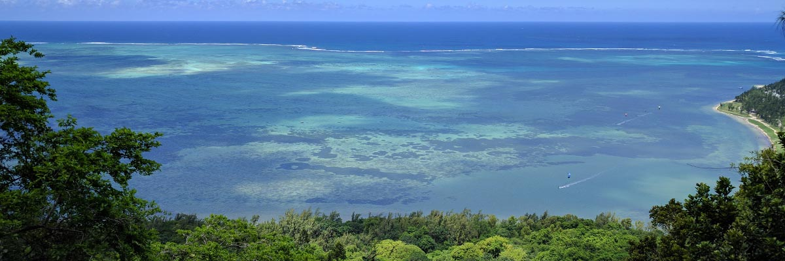
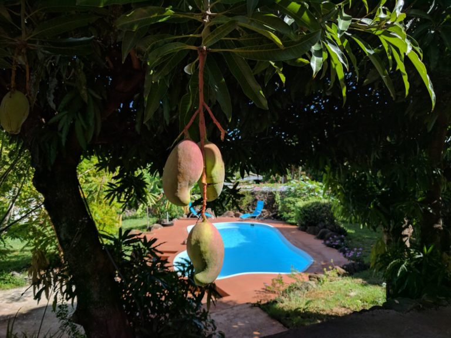
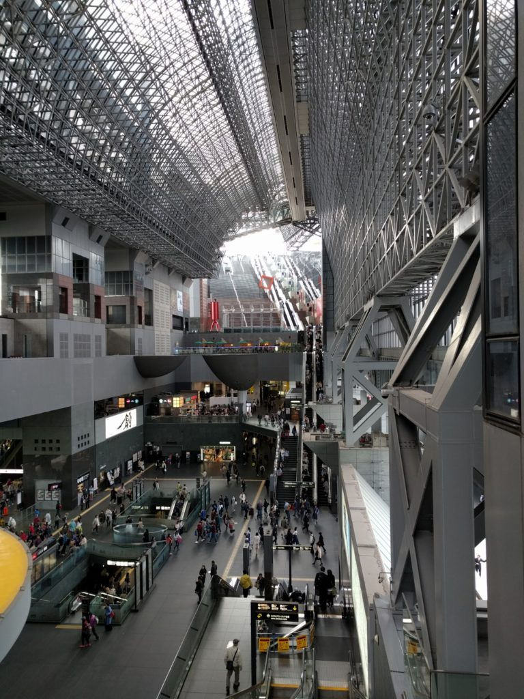
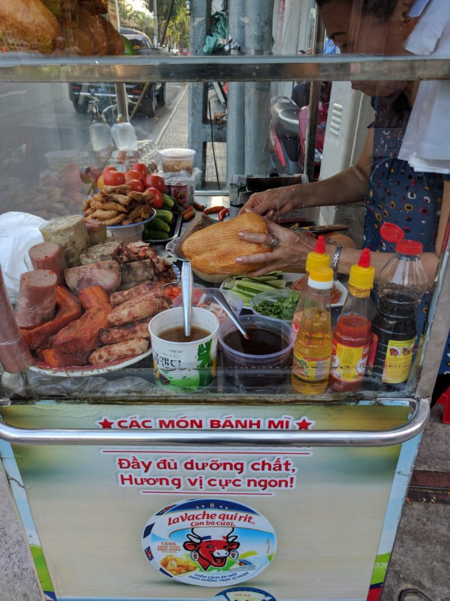

6 months ago I wrote an article with a 6-month breakdown of my spending to show [how I cut spending by traveling](/blog/how-i-save-money-by-traveling-the-world/). Another 6 months have passed so I thought I would compare it to the first 6 and show how much I spent after a full year of traveling around the world. The following estimates are for essentials accommodations, transportation & food.

**A few things to keep in mind:**

- _To keep all of my estimates at an even 6 months, I will list what I have spent between January 22nd, 2017 and June 21st, 2017._
- _Estimates for public transportation and food are rough calculations._
- _These estimates do not include things such as entertainment, clothing purchases(which I rarely have anyways), cell phone bills, etc.. In reality, I spend more than this._

 My AirBNB in Mauritius

## Accommodations

The first 6 months of my journey, I went to Japan, South Korea, Taiwan, Singapore, and Australia. I was lucky that I had many friends to help house me for cheap and bring my 6-month accommodation spending to **\$800**. I wasn't able to get my accommodation costs quite as low this past 6 months but I still did a good job. I owe a lot to wonderful friends that helped me out with places to sleep during my journey. [Airbnb](http://www.airbnb.com.au/c/erics20340) also worked out very well and I found a couple great places at a good price.

#### My accommodation breakdown:

**Melbourne, Australia:**  \$0 for 1 month (amount paid included from first 6-month breakdown)

**Mauritius:** \$400 for 1 month

**Ho Chi Minh, Vietnam:**  \$17 for 10 days

**Niigata, Tokyo, Osaka & Shiga, Japan:**  *\$193* for 5 weeks

**Seoul, South Korea:** _\$300_ for 9 weeks

 Kyoto Station

## Transportation

I proved in my article about the first 6 months of my travels that globetrotting does not have to be expensive. After constantly tracking airplane prices, I was able to snag a few good deals along with a business trip that got me a free flight. Compared to my first 6 months of transportation costs (**\$2905**), this time around I cut my spending on transportation in about half! I highly recommend [Google Flights](http://www.google.com/flights) if you are trying to track flight prices and waiting for that right moment to book a flight.

#### My airplane breakdown:

**Australia -> Mauritius:** \$390

**Mauritius -> Vietnam:** \$280

**Vietnam -> Japan:** \$0

**Japan -> Korea:** \$85

#### My public transport breakdown:

**Melbourne, Australia:**  \$80 for 1 month

**Mauritius:** \$100 for 1 month

**Ho Chi Minh, Vietnam:**  \$50 for 10 days

**Niigata, Tokyo, Osaka & Shiga, Japan:**  \$350 for 5 weeks

**Seoul, South Korea:** \$170 for 9 weeks

\*Note: my transportation spending for Vietnam should have been closer to about 20 dollars [if it wasn't for getting ripped off by a taxi driver](/blog/swindled-taxi-driver-first-night-vietnam/)

 Street food in Ho Chi Minh

## Food

Just a disclaimer, this category is the most difficult to calculate so the estimates are rather on the rough side. My first 6-month breakdown for food was calculated at **\$3,540**. Most of my time then was spent in countries that were a bit more expensive and I didn't do much cooking. This past 6 months I brought my spending down quite a lot by traveling to cheaper countries and trying hard to cook more and eat healthy (I lost about 5 kilos in the past few months).

#### My food breakdown:

**Australia:**  \$350 for 1 month

**Mauritius:** \$300 for 1 month

**Vietnam:**  \$50 for 10 days

**Japan:**  *\$500* for 5 weeks

**South Korea:** *\$1300* for 9 weeks

## Conclusion

In my first article on [how I save money by traveling](/blog/how-i-save-money-by-traveling-the-world/), I compared how much I would have spent living at home in the US vs how much I actually spent by traveling. I estimated that essentials for 6 months at home would have cost me around **\$12,380** but by traveling I only spent about **\$7,245**. This time around I am comparing the most recent 6 months of my travels to the first 6 months and found out I was able to bring my spending down even more.

##### The first 6 months living overseas (6/21/2016 - 1/21/2017):

- **Accommodations: \$800**
- **Transportation: \$2,905**
- **Food: \$3,540**

##### **Total: <u>\$7,245</u>**

##### The past 6 months living overseas (1/22/2017 - 6/21/2017):

- **Accommodations: \$910**
- **Transportation: \$1,505**
- **Food: \$2,500**

##### **Total: <u>\$4,915</u>**

That means my total essentials spending for the past year was **\$12,160**! That is basically the same as my estimate for 6 months of living at home. So according to my (rough) calculations, By traveling the world this past year I saved about \$12,600!

If you are looking for advice on traveling the world (and saving money while doing it), feel free to [send me a message](/contact/)!
