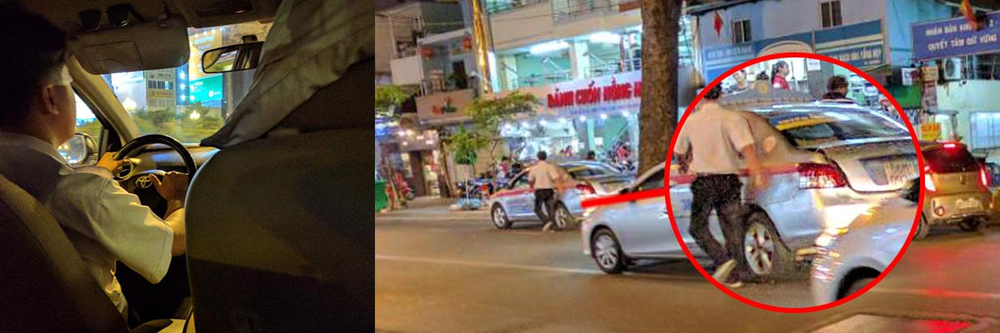
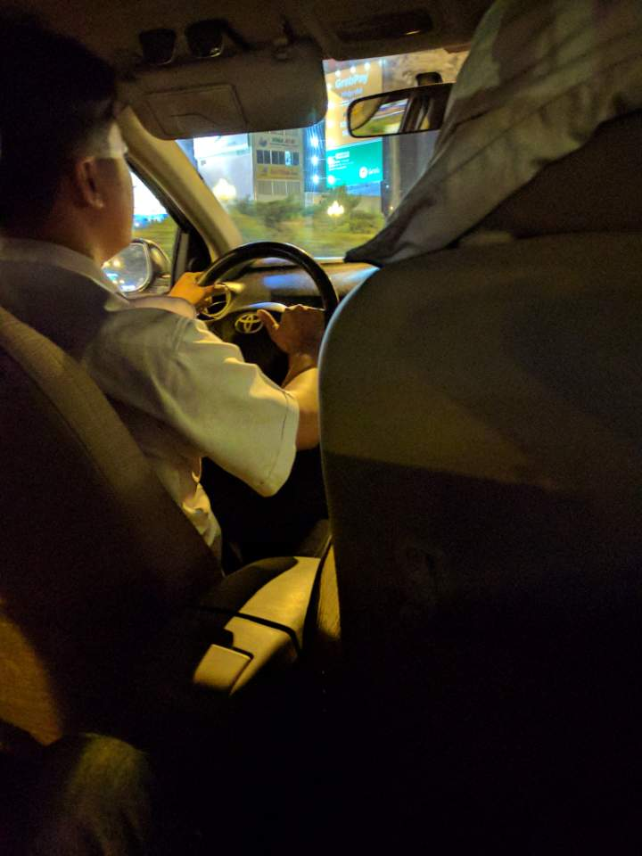
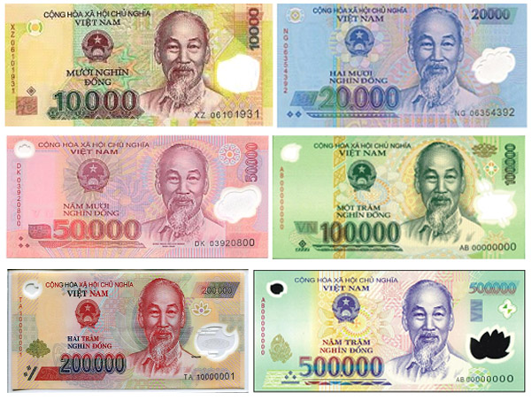
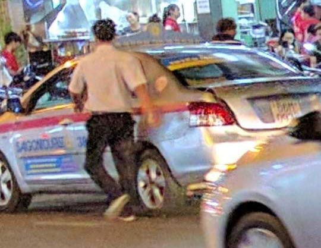

People are most vulnerable when first arriving at a country because everything is new and confusing. Taxi drivers know this and unfortunately, in some countries, they love to take advantage of it. As a veteran traveler, it is a bit embarrassing to admit that I let myself get swindled but I think it is best to share my story so that others do not make the same mistake that I did.

## Before Arrival

In an earlier post about [preparing for international travel](/blog/how-to-prepare-for-your-international-adventure-pt1/), I mentioned that research is very important. I followed my advice and learned a few things about my taxi ride before blindly hopping into a taxi.

1.  $1 USD is about 22,000 dong
2.  A ride to my accommodation would cost around 150,000 dong (about $7 USD)
3.  An Uber ride would be about 80,000 dong but sometimes random people stand in front of the airport pretending to be your uber driver and rip you off
4.  Many taxi drivers that approach you will try to hustle you so go in the taxi line on the left side of the airport
5.  The two main taxi companies you can trust are Mai Linh and Vinasun (when I arrived I only remembered that one started with an M and one started with a V)
6.  There is a small toll of 10,000 to pay when leaving the airport and you will have to give money to the taxi driver for it on top of the fare. (I was unclear on the details here when I reached the toll gate)

After doing research, I figured that I was mentally prepared enough to get myself to my accommodation without getting swindled. I then put my focus on trying to actually locate where I would be sleeping. My phone service (Project Fi) covers me in 135 countries but unfortunately, Vietnam is not one of them so I was a bit worried about directions.

## At the airport

After a couple long flights, waiting for my visa on arrival, and exchanging money, I finally made it out of the airport. Again, knowing that I would not have a way to contact my Airbnb host if I got lost was taking up most of my mental energy. At the moment my mind was not on my money. Just as I thought would happen, once I stepped outside a taxi driver approached me asking if I needed a ride. Knowing full well that it would cost me more than a normal driver I ignored him and made my way to the taxi line.

##### Mistake #1

I went to the taxi line, the lady waiting there wrote down a number on a piece of paper (#23), gave it to the driver, and I got in the taxi. I remembered about getting in the taxi line and figured there would be no problems since I dodged the shady guy earlier and made my way to the line. I totally forgot however to check the company of the taxi. Turns out the one I got in was not one of the 2 trusted companies that I researched.

## In the taxi

The taxi driver was very friendly and helped me put my bag in his car. He also spoke English so it helped me relax a little bit. When I got in the taxi, I made sure that he started the meter. I knew sometimes drivers will say they forgot to turn it on and charge you more once you arrive. The taxi meter was running now so I figured there would be no problems and stupidly let my guard down.

##### Mistake #2

We chatted a bit and one of the first questions he asked me is if it was my first time in Vietnam. A harmless question of course so I replied, "yes." In retrospect, however, this told the taxi driver "I don't know how much things here cost, I'm not used to the exchange rate, and I don't know the exact route to get to my hotel so feel free to rip me off." Now I am not saying you should go around lying to and distrusting all taxi drivers but looking back this might not have been the best thing to admit.

##### Mistake #3

When leaving the airport, we came up on the toll gate and this is where things went wrong quick. Now, in an article I read on [Trip Advisor](https://www.tripadvisor.com/Travel-g293925-c30891/Ho-Chi-Minh-City:Vietnam:Airport.Arrival.And.Departure.html), it said, "The airport exit toll fee is 10,000 dong and the driver must pay it but they will always add 10/15.000 dong at your arrival." I wish I had remembered this in more detail. I only remembered that there was a toll when exiting.

So when we came up to the toll gate, the driver said "50,000 dong for the toll please." I was thinking it was 10,000 but who knew if the article was outdated or if I remembered incorrectly so I searched for 50,000\. The inside of the taxi was dark and all of the bills look very similar so I pulled a few out of my wallet to look through them. At this moment, the taxi driver offered to help me find 50,000 and took the money from my hand to look through it. The exact moment he touched my money, things no longer felt right. Any trust gained from the opening chat with the taxi driver was all gone and I was eyeing his hands like a hawk. When he finally took a bill out for the toll, he tried to create a moment of chaos by fumbling when handling me back my money. I knew exactly what he was doing and saw him drop one of the bills in the front seat (I was directly behind the passenger seat). I gathered my cash, let him pay the toll with my money, and give me the change.

After that, I looked up at the passenger seat and saw a 100,000 dong (About $5 USD) bill sitting there. I said to him "hey, what is that buddy?" He replied, "Uh, it must have fallen when I dropped your money... here you are." Of course, I didn't believe him. I knew exactly what he was doing and caught him.

Now, at this point, I could have started swearing at him or threaten to call the police on him. However, I assessed the situation and a few things went through my mind. First, I remembered a story my friend told me when a taxi driver in India took him to a shady place and when he got out 2 people held guns to his head and robbed him. Extremely unlikely that something like this would happen but it did make me think. At that moment I didn't know where we were going and if I escalate the situation I might not get to my destination.

So my decision was to pretend at this point that I thought it was a mistake on his part that he dropped one of my bills. Then, after getting out of the taxi I would take a picture of his license plate and report him. (little did I know at the time it would have been a worthless effort)

## After the toll gate

I am now in high alert mode. First thing I do is take a picture of the driver without him knowing. Who knows if it will come in handy or not later. Next thing I do is turn on Google Maps to make sure he is going in the right direction.

_*Pro traveler tip: Even if you don't have an internet connection GPS can still track your location so you can use it like a compass to find your way offline_

##### Mistake #4

I then thought it might be a good idea to look back at my money and make sure it was all there. At the airport, I paid $25 USD for a visa, was given back a bit of change in dong and the rest in USD. I then exchanged $40 within the airport so that I would have a small amount for the next few days. What I should have done here is properly count my money and familiarize myself with the dong so I knew exactly how much I had. Since I didn't do that, I was a bit confused when counting my money in the taxi.

First off, the 10,000 and 100,000 dong notes look almost identical in the dark (why do all notes have the same guy's face?!). Also, the exchange rate wasn't clear in my head so counting the bills I had seemed useless. I figured that I didn't have that much anyways and I was pretty sure I already caught him so called it quits on a detailed money count.

## Exiting the taxi

As we are coming up on my destination, I was thinking at this point that there was nothing else to worry about. I caught the guy so when I exit the taxi I will take a picture of his plate and all will be settled. At that moment, however, he said, "Your total is 450,000 dong (about $20 USD)."

##### Mistake #5

I was so worried about how much was in my wallet and looking at the GPS that I totally forgot to check the meter! You have to remember at this point I didn't know what brand taxi I was in, I figured that since I caught a taxi from the line that the meter rate would be fixed.

##### Mistake #6

Looking back, I should have been way more assertive here. I am still kicking myself about the way I handled this part. I was already at my destination so I didn't have to worry about getting lost. I guess since my bags were still in the trunk I was still thinking about them, perhaps.

Anyways, I said "450?! It should only be 150, why is it so much?!" He said yes, it is 450, look at the meter." I should have replied, "YOU TRIED TO STEAL FROM ME! I'M NOT PAYING." But alas, I thought to myself whatever, I will be reporting this guy anyways and it isn't that much money. (I still didn't have the exchange rate figured out so I didn't realize it was 20 dollars at the time). So I pulled out 400,000 and when I was about to get the other 50 he said, "that is good enough." No taxi driver ever charges you less than the meter says. This guy was completely scamming me.

Right after he took my money, the driver got out of the taxi and grabbed my bag out of the trunk and started wheeling it away. At this point, I am insanely pissed and defensive so I thought he might try something with my bag if I don't get to him soon enough. because of this, I didn't have enough time to get out my camera and snap his plate so I tried to memorize it as I walked by it. (It turns out that he was just trying to help me cross the street with my suitcase because traffic is insane.)

I was really tempted to just beat this guy's ass. I had no idea where I was though and didn't trust anyone at this point so figured that my bags might get stolen if I set them down to start something. I said screw it and just let the driver go back to his taxi. I then took a picture of the taxi from across the street and managed to get a blurry plate number out of it.

## Arriving at my accommodation

It took forever to find where I was staying but I finally made it. At this point I talked to a few locals I was in contact with about what happened. None of them seem surprised. In fact, the general consensus was that going to the police about this would be a waste of time. Cops here are crooked and take bribes daily.

I should have thought of this. I don't know why I thought that taking a picture of his license plate would have magically made everything better. On top of that, I am only here for a week so If he ever was caught I wouldn't have enough time to follow up on it and get my money back.

## Where I get really pissed

So the last thing I did for the night was to go back and do a thorough count of my money. Between what I bought and money I exchanged, it took a bit of time to figure out how much I should have vs. how much I actually did. After counting, I realized...... I was 500,000 dong ($22 USD) short!

Playing back every scenario in my head, the only time he could have stolen 500 from me was when I was giving him money for the toll. I thought he took 50,000 but in reality, he took 500,000\. Of course, if I realized this in the taxi things would have gone verrrrryyy differently at the end of the trip. I keep playing back scenarios in my head of me doing bad things to him haha.

## What I took away from this

There are a number of things that I learned from this and hope that others can take away as well.

1.  Completely following/remembering the research you do is just as important as the research itself.
2.  Know how much money you have and memorize exchange rates first off.
3.  Not all friendly people can be trusted. This can often be a trick.
4.  I should have made the driver pay the toll then pay back the difference at the end of the trip.
5.  NEVER let anyone touch your money. I chose to eye the driver's hands as he held my money to try and catch him. I should have told him not to touch it in the first place.
6.  Just because a taxi meter is running doesn't mean it is legit. If you can, get an estimate up front on how much the ride should cost.
7.  Be assertive when necessary. This is more advice to myself than anything. I was a bit too passive at the end of the ride because I just wanted to get to my hotel and really didn't care about the 10 or so dollars I believed I was getting swindled out of at the time.

So in the end, a 150,000 dong taxi ride ended up costing me **900,000** **dong** ($40 USD). I admit it, he got the best of me. $40 doesn't sound like THAT much but with 900,000 dong I could have gotten:

*   6 taxi rides
*   4.5 hours worth of massages
*   60 bánh mì (Vietnamese sandwiches)

Instead, I got:

*   1 taxi ride
*   life experience points
*   this blog article