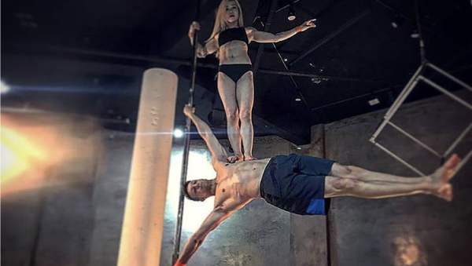

I Started breakdancing in 2001 and after 15 years branched mainly into calisthenics. After exploring various paths such as martial arts, acrobatics, and dance, I have come up with functional fitness methods to help others become not only strong but mobile as well. Exercises are always different, challenging, and enjoyable so that it feels more like play than work.