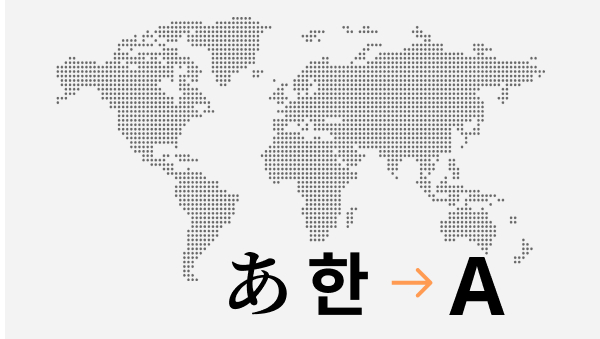

I am fluent in both Japanese and Korean and have experience translating and interpreting in both. I have translated and subtitled movies and youtube videos, menus, and various texts. Interpretation has also been done for events, workshops, and business meetings. The bulk of my translation work is mostly from Japanese or Korean to English. Last, I have 8 years English teaching experience and can proof-read and edit English copy.